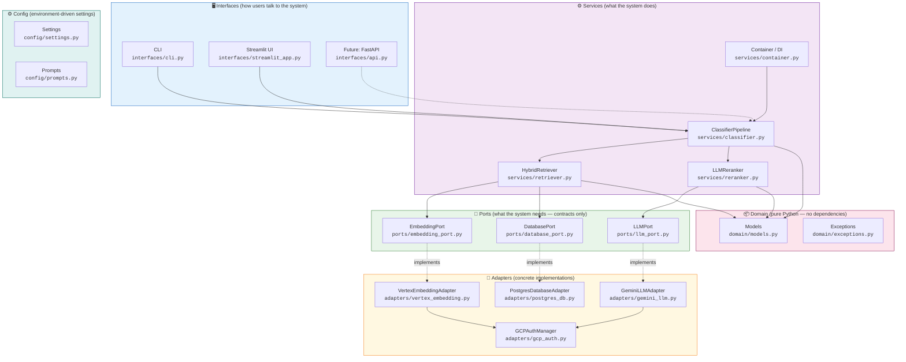
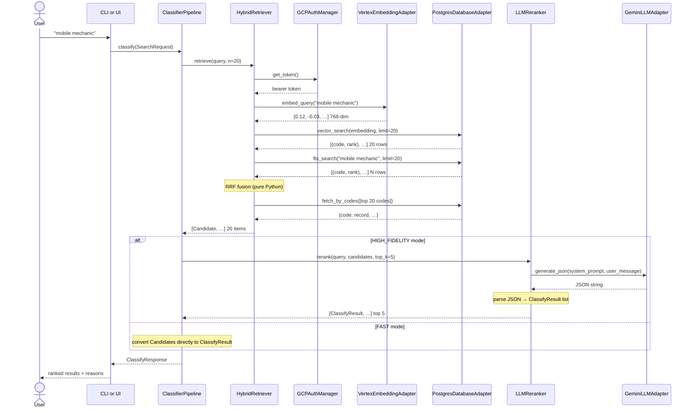

# Architecture

The ANZSIC Classifier is built using **Hexagonal Architecture** (also known as
Ports & Adapters). This page explains what that means, how the layers are
organised, and — most importantly — what you can swap without touching anything else.

---

## The big picture



---

## The golden rule

> **Services import Ports. Ports never import Adapters. Adapters never import Services.**

This one rule gives the entire system its swappability. If you want to replace
Gemini with GPT-4o, you only need to:

1. Write a new `OpenAILLMAdapter` that satisfies `LLMPort`
2. Change **one import line** in `services/container.py`
3. Everything else — prompts, reranker logic, CLI, UI — is unchanged

---

## Layer-by-layer breakdown

### Domain (innermost — no dependencies)

The domain contains pure Python objects with no imports from any other layer.
It is the lingua franca of the system — every layer speaks in domain objects.

| File | Contents | Key types |
|---|---|---|
| `domain/models.py` | Pydantic models | `SearchRequest`, `Candidate`, `ClassifyResult`, `ClassifyResponse` |
| `domain/exceptions.py` | Exception hierarchy | `ANZSICError` and 7 subclasses |

The domain has **zero infrastructure dependencies** — no database, no network,
no GCP. This means domain logic can be tested in microseconds.

---

### Config (reads environment, no I/O at import time)

| File | Purpose |
|---|---|
| `config/settings.py` | All tunable parameters, loaded from `.env` / env vars |
| `config/prompts.py` | Every LLM prompt string and 3 builder functions |

`Settings` is a frozen dataclass — values are immutable at runtime.
`get_settings()` is an `@lru_cache` singleton — one settings object per process.

---

### Ports (abstract contracts — Python `Protocol` classes)

Ports define **what** the system needs from the outside world, without saying
**how** it gets it.

| Port | Methods | Purpose |
|---|---|---|
| `EmbeddingPort` | `embed_query`, `embed_document`, `embed_documents_batch` | Turn text into vectors |
| `LLMPort` | `generate_json` | Generate a ranked JSON response |
| `DatabasePort` | `vector_search`, `fts_search`, `fetch_by_codes` | Retrieve ANZSIC records |

Ports use Python's `typing.Protocol` with `@runtime_checkable`. Mock adapters
in `tests/conftest.py` satisfy these protocols without inheriting from any class.

---

### Adapters (concrete implementations — one per technology)

Each adapter implements exactly one Port using a specific technology.

| Adapter | Implements | Technology |
|---|---|---|
| `VertexEmbeddingAdapter` | `EmbeddingPort` | Vertex AI `text-embedding-005` |
| `GeminiLLMAdapter` | `LLMPort` | Vertex AI Gemini REST API |
| `PostgresDatabaseAdapter` | `DatabasePort` | psycopg2 + pgvector |
| `GCPAuthManager` | *(shared)* | `gcloud auth print-access-token` subprocess |

`GCPAuthManager` is shared across both GCP adapters — a single token refresh
serves both the embedding and LLM adapters, avoiding double auth calls.

---

### Services (business logic — imports only Ports, never Adapters)

| Service | Responsibility |
|---|---|
| `HybridRetriever` | Stage 1: embed query → vector search + FTS → RRF fusion → fetch records |
| `LLMReranker` | Stage 2: build prompt → call LLM → parse JSON → CSV fallback |
| `ClassifierPipeline` | Orchestrator: route by `SearchMode`, call Stage 1 ± Stage 2 |
| `container.py` | **The only file that names concrete adapters** — wires everything together |

The `compute_rrf()` function inside `retriever.py` is extracted as a standalone
pure function (no class, no I/O) — it is the easiest function to unit-test in
the entire codebase.

---

### Interfaces (how users interact — imports only Services)

| Interface | Entry point | Use case |
|---|---|---|
| `interfaces/cli.py` | `anzsic-classify --query "..."` | Automation, scripting, batch jobs |
| `interfaces/streamlit_app.py` | `streamlit run prod/interfaces/streamlit_app.py` | Interactive exploration |
| *(future)* `interfaces/api.py` | `uvicorn prod.interfaces.api:app` | REST API service |

All interfaces call `get_pipeline().classify(SearchRequest(...))` — a single
function call that hides all infrastructure complexity.

---

## Data flow: single query



---

## Dependency rules (enforced by convention)

```
Domain    ← no imports from other prod layers
Config    ← only stdlib + dotenv
Ports     ← only Domain + typing
Adapters  ← Ports + Domain + Config + external libs
Services  ← Ports + Domain + Config  (NEVER Adapters directly)
Interfaces← Services + Domain
container ← ALL layers (the wiring point)
```

Violating these rules is the only way to break swappability. The test suite
catches violations because mock adapters satisfy Port protocols without
importing any real adapter class.

---

## Future evolution

Adding a FastAPI REST service requires **no changes to any existing file**:

1. Create `prod/interfaces/api.py` with FastAPI routes
2. Call `get_pipeline().classify(SearchRequest(...))` in each route handler
3. `ClassifyResponse` already serialises to JSON via `.to_dict()` / Pydantic

The Pydantic domain models map directly to FastAPI request/response schemas —
no extra DTOs or transformers needed.
