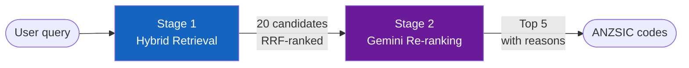

# ANZSIC Classifier

> **Classify any free-text occupation or business description into the correct
> Australian and New Zealand Standard Industrial Classification (ANZSIC) code
> — in under 3 seconds.**

---

## What it does

The ANZSIC Classifier takes unstructured text like *"mobile mechanic"* or
*"person who fixes cars at your home"* and maps it to the precise 6-digit
ANZSIC unit-group code that best describes that economic activity.

It works in two stages:

| Stage | What happens | Technology |
|---|---|---|
| **1 · Hybrid Retrieval** | Vector ANN search + FTS fused via Reciprocal Rank Fusion | pgvector · PostgreSQL 15 |
| **2 · Re-ranking** | LLM reads candidates and selects best matches with reasons | Vertex AI Gemini |

**Fast mode** runs Stage 1 only (< 300 ms). **High Fidelity mode** adds Stage 2
(2–5 s) for production-quality results with natural-language explanations.

---

## Key features

- **5,236 ANZSIC codes** indexed with 768-dimensional semantic embeddings
  (Vertex AI `text-embedding-005`)
- **Handles colloquial descriptions** — *"barista"*, *"tradie"*, *"runs a cafe"*
  — that rule-based or FTS-only systems miss
- **CSV fallback** — if Gemini returns no results, retries with the full code
  reference injected into the prompt
- **Hexagonal architecture** — swap any component (DB, embedding model, LLM)
  by changing one line in `container.py`
- **65 automated tests** — 100% pass, no live services needed for unit tests

---

## Quick navigation

-   :material-rocket-launch:{ .lg .middle } **Quickstart**

    ---

    Get the classifier running on your machine in under 5 minutes.

    [:octicons-arrow-right-24: Quickstart guide](guides/quickstart.md)

-   :material-sitemap:{ .lg .middle } **Architecture**

    ---

    Understand the Hexagonal (Ports & Adapters) design and how the layers
    fit together.

    [:octicons-arrow-right-24: Architecture overview](architecture.md)

-   :material-console:{ .lg .middle } **CLI reference**

    ---

    Classify queries from the command line — single queries or batch files.

    [:octicons-arrow-right-24: CLI guide](guides/cli.md)

-   :material-monitor:{ .lg .middle } **Streamlit UI**

    ---

    Use the interactive web interface for single and batch classification.

    [:octicons-arrow-right-24: Streamlit guide](guides/streamlit.md)

-   :material-book-open-variant:{ .lg .middle } **API Reference**

    ---

    Auto-generated reference for every module, class, and function.

    [:octicons-arrow-right-24: API reference](reference/services.md)

-   :material-lightbulb-on:{ .lg .middle } **Decision Records**

    ---

    Why hexagonal architecture? Why pgvector? Why RRF? Read the ADRs.

    [:octicons-arrow-right-24: Design decisions](decisions/001-hexagonal-architecture.md)

---

## Tech stack

| Component | Technology | Version |
|---|---|---|
| Language | Python | 3.12+ |
| Embeddings | Vertex AI `text-embedding-005` | 768-dim |
| LLM | Vertex AI Gemini | `gemini-2.5-flash` |
| Vector DB | PostgreSQL + pgvector | 15 + 0.8.0 |
| UI | Streamlit | 1.35+ |
| Models | Pydantic | v2 |
| Tests | pytest | 8.0+ |
