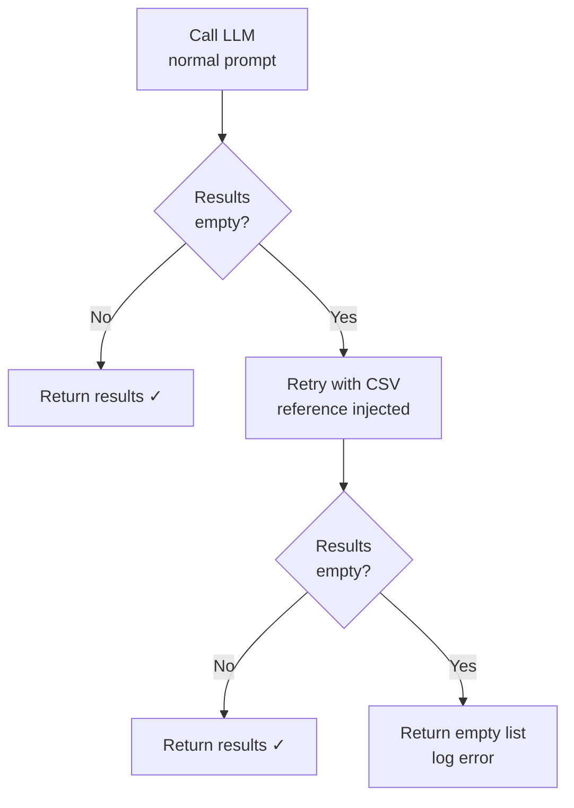

# Services

Services contain the core business logic of the ANZSIC classifier.
They import only Port protocols and domain models — never concrete adapters.

The dependency injection container (`container.py`) is the **one exception** —
it is the single file that names concrete adapter classes and wires the graph
together.

---

## ClassifierPipeline

The main entry point for all interfaces (CLI, Streamlit, future API).
Call `classify(SearchRequest)` → `ClassifyResponse`.

::: prod.services.classifier
    options:
      members:
        - ClassifierPipeline
        - _candidate_to_result

---

## HybridRetriever

Stage 1 of the pipeline. Orchestrates embedding, dual search, RRF fusion,
and record fetch into a list of `Candidate` objects.

The `compute_rrf()` function is extracted at module level (not inside the class)
so it can be called directly in unit tests without any adapter or fixture setup.

::: prod.services.retriever
    options:
      members:
        - HybridRetriever
        - compute_rrf

---

## LLMReranker

Stage 2 of the pipeline. Builds a structured prompt, calls the LLM,
parses the JSON response, and implements the CSV fallback strategy.

### CSV fallback strategy



The first call never includes the 5,236-code CSV reference — keeping the
prompt short (~2K tokens). Only if Gemini returns an empty array does the
reranker retry with the full reference injected (~63K tokens). This
*retry-on-empty* strategy outperforms *always-inject* because:

- Most queries match within the 20 Stage 1 candidates — no CSV needed
- Gemini's attention is not diluted by 63K tokens of irrelevant codes on
  the majority of calls
- The retry adds latency only for the rare low-confidence case

::: prod.services.reranker
    options:
      members:
        - LLMReranker

---

## Container (Dependency Injection)

The wiring point. Instantiates all adapters and injects them into services.

```python title="Swapping the LLM — change exactly one line"
# Before
from prod.adapters.gemini_llm import GeminiLLMAdapter
llm = GeminiLLMAdapter(auth, settings)

# After (hypothetical OpenAI swap)
from prod.adapters.openai_llm import OpenAILLMAdapter
llm = OpenAILLMAdapter(settings)
```

::: prod.services.container
    options:
      members:
        - get_pipeline
